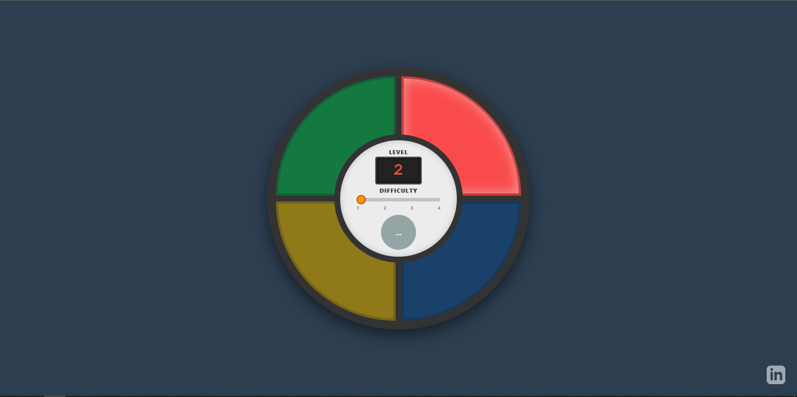
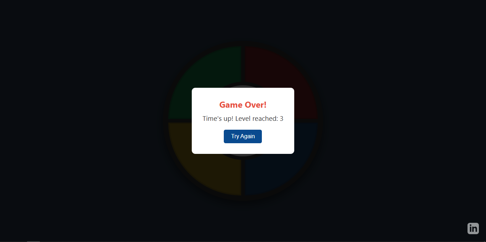

  

    <a href="./README.en.md">🇺🇸 Read in English</a>

Estava me ponderando: “Qual projeto fazer?” e decidi fazer um projeto que todo mundo conhece, e que eu posso compartilhar facilmente. Estou me enturmando com o front-end e, para isso, desenvolvi um jogo que todos (provavelmente) já jogaram...

Este é um projeto de um jogo de memória estilo "Genius", desenvolvido com HTML5, CSS3 e JavaScript ES6. O projeto foi estruturado para ser limpo, organizado e fácil de entender, além de estar pronto para ser hospedado no GitHub Pages.

  
  

## Como Jogar

1.  Clique no botão **PLAY** no centro do tabuleiro
2.  O jogo irá iluminar uma cor e emitir um som
3.  Repita a sequência clicando na mesma cor
4.  A cada rodada, uma nova cor é aleatoriamente adicionada na sequência
5.  O jogo termina se você errar a sequência ou deixar o tempo acabar

## Estrutura 

*   `index.html`: Estrutura principal da página
*   `css/`
    *   `style.css`: Estilos visuais, animações e responsividade
*    `img/`: Imagens para o readmee
*   `js/`
    *   `game.js`: Lógica principal do jogo (regras, sequência, validação)
    *   `ui.js`: Controle da interface (sons, luzes, mensagens)

## Detalhes Técnicos

### Resumo
O código segue o padrão **event-driven** (orientado a eventos). O navegador escuta interações, a classe `Game` processa esses eventos baseada no estado atual, e invoca métodos da classe `UI` para refletir as mudanças para o usuário.

###  Detalhes:
O código foi modularizado em duas classes principais:

1.  **UI (`js/ui.js`)**: Responsável pela camada de apresentação, manipulação do DOM e feedback sensorial.
2.  **Game (`js/game.js`)**: Gerencia o estado da aplicação, regras de negócio, validação de input e fluxo do jogo.

#### Áudio e Performance 
*   **Web Audio API**: Utilizada para sintetizar sons usando osciladores em tempo real, sem necessidade de carregar arquivos de áudio.
*   **Lazy Initialization**: O método `initAudio()` cria o contexto de áudio apenas após a primeira interação do usuário, contornando bloqueios de **Autoplay Policy** dos navegadores.
*   **Otimização de Renderização**: Mantém referências cacheadas dos elementos HTML e altera classes CSS para disparar transições aceleradas por GPU, evitando *Reflows* desnecessários.

#### Lógica do Jogo 
*   **Estado**: Mantido em propriedades de instância (`sequence`, `playerSequence`, `level`). A *Source of Truth* é o array `sequence`.
*   **Assincronismo**: O método `playSequence()` utiliza `async/await` e `Promises` para criar pausas não-bloqueantes na *Main Thread*, permitindo tocar a sequência de cores sem travar a interface.
*   **Validação em Tempo Real**: `handlePlayerInput()` valida cada clique comparando com o índice atual da sequência, permitindo detecção de erro imediata.
*   **Timers**: Uso inteligente de `setTimeout` e `clearTimeout` para gerenciar a janela de tempo de resposta.

#### Estilização 
*   **CSS Variables**: Uso de *Custom Properties* para facilitar a manutenção e consistência do tema.
*   **Alta Performance**: As animações utilizam exclusivamente `transform` e `opacity`, propriedades que não disparam *Layout Thrashing*, garantindo 60fps em dispositivos móveis.
*   **Responsividade**: `Media Queries` e unidades relativas adaptam o layout para diferentes tamanhos de tela.

## Como rodar localmente

Caso opte por não jogar pelo link anexado no repositório.

Para rodar este projeto localmente, você precisa apenas de um navegador web.

1.  Clone este repositório ou baixe os arquivos
2.  Abra o arquivo `index.html` no seu navegador 

## Autor:

Desenvolvido com ❤️ por Vitor Nonato Nascimento.
    GitHub: https://github.com/NONATO-03
